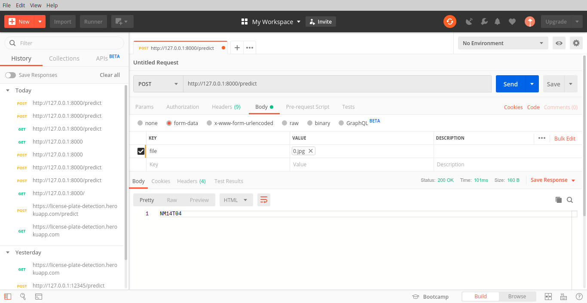

# license-plate-OCR
`TCS humAIn` The repo will contain code for the `OCR` on license plates.

The conda env: `crnntf`

# Input
Let's test our model shall we? 

# Processing
The model has been wrapped into a Flask application. :fire: :raised_hands: :fire:  

# Output
The `String` output that can be seen in the body of the `Postman App`. 
`NM14T04`
